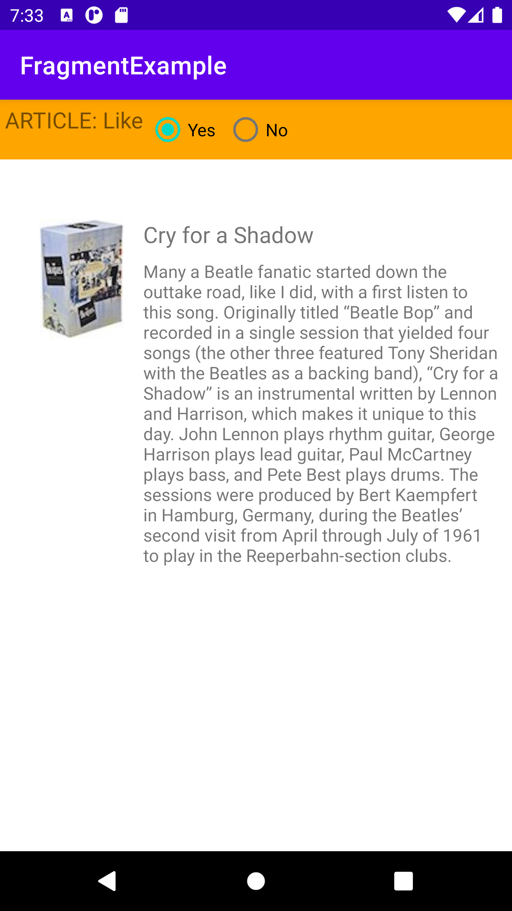
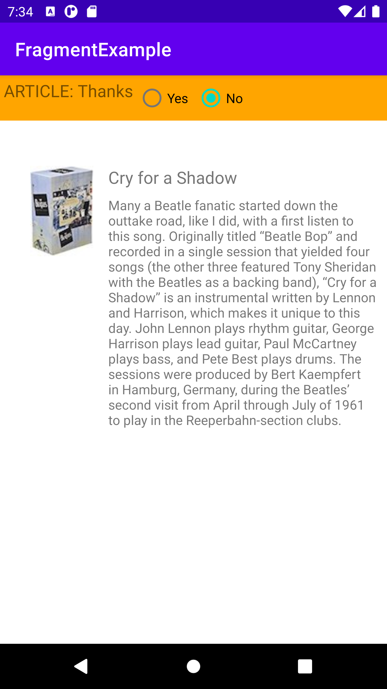
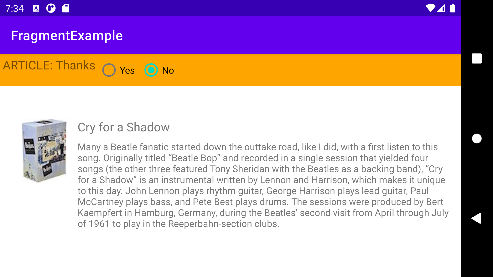

Fragments
======================
## TASK 1
========================
#### Including a fragment for the entire activity.

#### When user clicks on the Yes radio button the message called "like" is generated.

#### When user clicks on the No radio button the message called "Thanks" is generated.

#### Since fragment can retain an instance of its data, rotating a device will not affects the data inside the fragment.

#### App video Demonstration

===========================================================================
